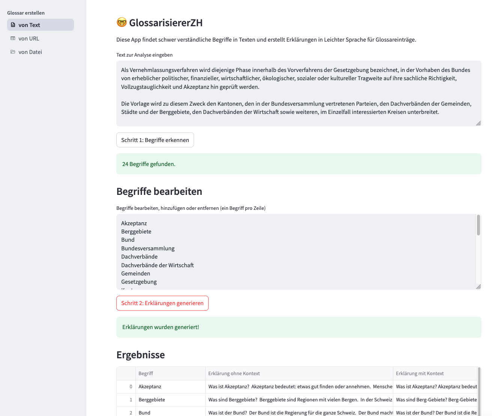

# Simply Create Glossaries in Plain Language

**Create Plain Language glossaries from texts, URLs, and files using LLMs.**


[](https://github.com/machinelearningZH/simply-simplify-language-glossarizer)
[](https://github.com/machinelearningZH/simply-simplify-language-glossarizer/stargazers)
[](https://github.com/machinelearningZH/simply-simplify-language-glossarizer/issues)
[](https://img.shields.io/github/issues-pr/machinelearningZH/simply-simplify-language-glossarizer)
[](https://github.com/machinelearningZH/simply-simplify-language-glossarizer)
<a href="https://github.com/astral-sh/ruff"></a>

<details>
<summary>Contents</summary>

- [Features](#features)
- [Installation](#installation)
- [Running the App](#running-the-app)
- [Project Information](#project-information)
- [Project Team](#project-team)
- [Feedback and Contributing](#feedback-and-contributing)
- [License](#license)

</details>



## Features

- **Automated Glossary Creation**: Generate glossaries that simplify complex terms and concepts to [Plain Language in German](https://www.zh.ch/de/webangebote-entwickeln-und-gestalten/inhalt/barrierefreiheit/regeln-fuer-leichte-sprache.html).
- **Multiple Input Sources**: Process text from **direct text input**, **URLs**, or **.txt file uploads**.

## Installation

To install the project and its dependencies:

```bash
git clone https://github.com/machinelearningZH/simply-simplify-language-glossarizer.git
cd simply-simplify-language-glossarizer

pip3 install uv
uv venv
source .venv/bin/activate
uv sync
```

The app uses the OpenAI LLM API. You need to create an API key and save it to an `.env` file. At the moment, the app assumes that your key is saved to `.env_example`.

## Running the App

Start the Streamlit app:

```bash
cd _streamlit_glossarizer
streamlit run home.py
```

The app will be available at `http://localhost:8501/`.

> [!WARNING]
> Be cautious with sensitive data as mentioned in the app warning. Use only for public, non-sensitive information as processing occurs on third-party servers.

> [!NOTE]
> At the moment only .txt files work with the file upload.

## Project Information

In Swiss administrative contexts, there's an increasing need to make complex documents and specialized terminology more accessible to the general public. This tool helps address that need by generating glossaries that explain difficult terms in Plain Language.

- Users can create simplified language glossaries from various text sources.
- The tool uses large language models (LLMs) to identify complex terms and generate clear, accessible explanations.
- It produces a draft glossary that **should always be reviewed and refined by users** before publication.
- For each term, the app provides two types of explanations:
  - One **with context**, based on the surrounding source text.
  - One **without context**, based solely on the LLM’s general knowledge.
    Contextual explanations are typically more accurate and relevant, but general explanations may still be useful in some cases.
- This tool contributes to the broader goal of making government communication more understandable and inclusive for all citizens.

## Project Team

- **Simone Luchetta** — [Staatskanzlei Zürich: Team Informationszugang & Dialog](https://www.zh.ch/de/staatskanzlei/digitale-verwaltung/team.html)
- **Chantal Amrhein**, **Patrick Arnecke** — [Statistisches Amt Zürich: Team Data](https://www.zh.ch/de/direktion-der-justiz-und-des-innern/statistisches-amt/data.html)

## Feedback and Contributing

We welcome feedback and contributions. [Email us](mailto:datashop@statistik.zh.ch) or open an issue or pull request.

We use [Ruff](https://docs.astral.sh/ruff/) for linting and code formatting.

Install pre-commit hooks for automatic checks before opening a pull request:
```bash
pre-commit install
```

## License

This project is licensed under the MIT License. See [LICENSE](LICENSE) for details.

## Disclaimer

This software (the Software) incorporates the open-source model `de_core_news` (the Model) from spacy.io and has been developed according to and with the intent to be used under Swiss law. Please be aware that the EU Artificial Intelligence Act (EU AI Act) may, under certain circumstances, be applicable to your use of the Software. You are solely responsible for ensuring that your use of the Software as well as of the underlying Model complies with all applicable local, national and international laws and regulations. By using this Software, you acknowledge and agree (a) that it is your responsibility to assess which laws and regulations, in particular regarding the use of AI technologies, are applicable to your intended use and to comply therewith, and (b) that you will hold us harmless from any action, claims, liability or loss in respect of your use of the Software.
